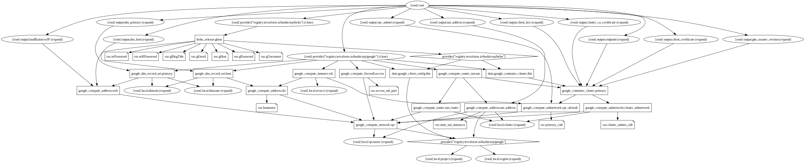
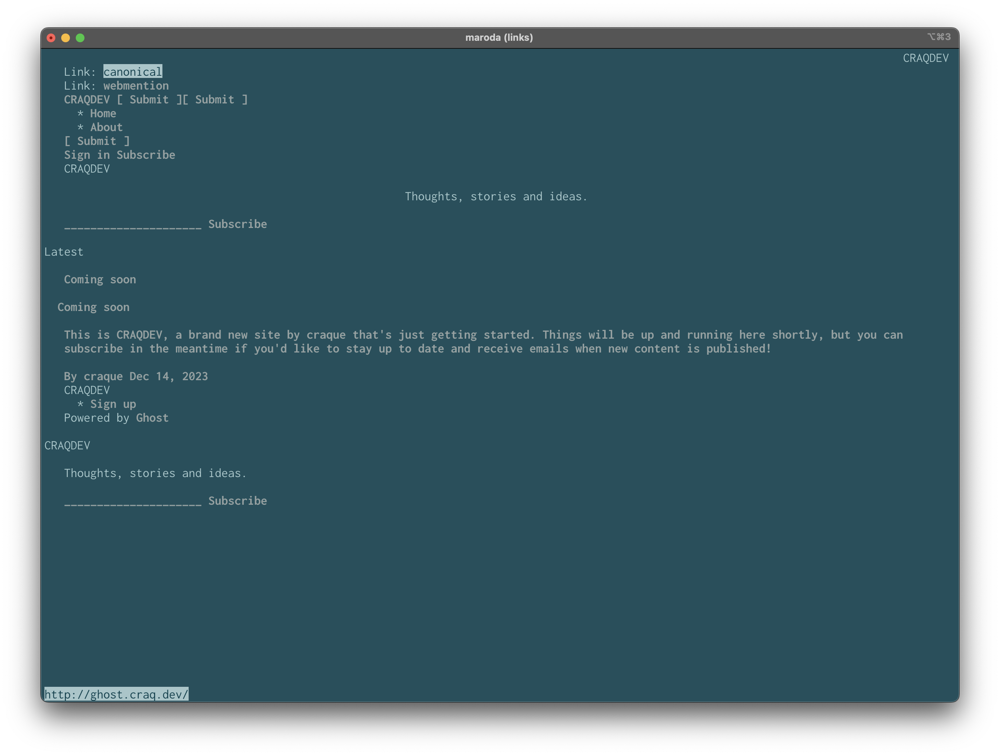
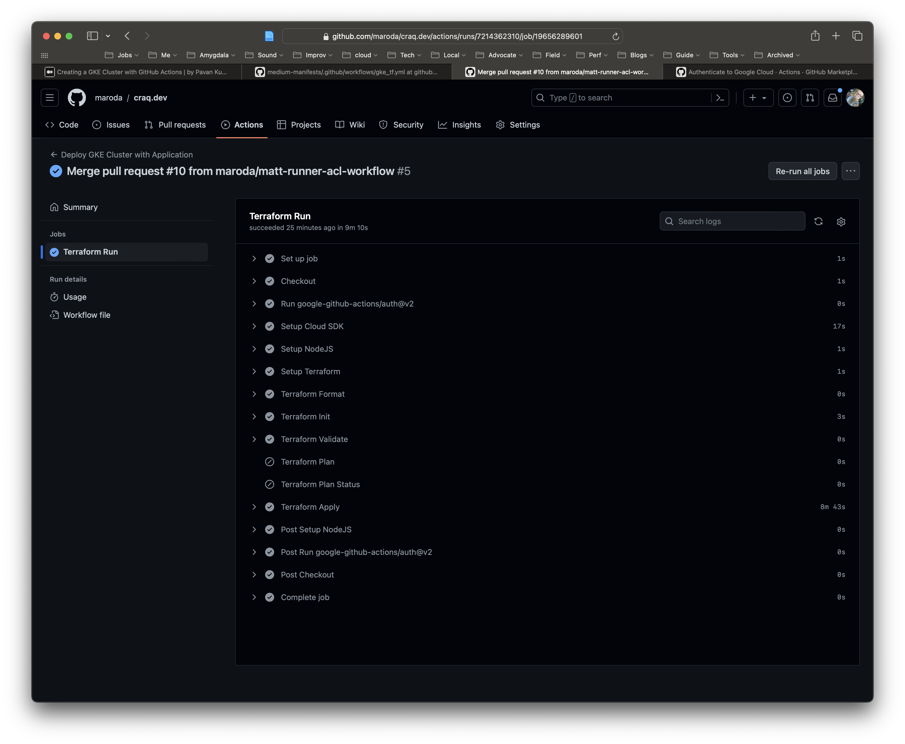

[](https://github.com/maroda/craq.dev/actions/workflows/google.yaml)

## Terraforming GKE and Ghost

CRAQDEV is a deployment of the Interview Challenge received Monday, Dec 11 at 8:51 AM PST. The original content of the challenge appears below under "DevOps Interview Challenge". This section documents the work I have done to complete the task.

### Overview

The goal is to display my knowledge of the following:

- **Terraform**. All required code appears in a flat directory structure, there are no modules beyond the root module. I built the entire module from scratch (based on the AWS configuration and working from there). Everything is built and deployed via this singular module, including a full Helm release for the Ghost blog skeleton.
- **Cloud Infrastructure**. Since I have the most recent experience on GCP, I accepted the option to build this in GCP instead of AWS.
- **Kubernetes**. GKE is the platform of choice and the one I have used the most (I learned kube on a RaspberryPi cluster built at home). I personally would choose GKE above any other cloud kubernetes platform.

Some aspects of deployment were not covered because they included larger levels of effort that extended beyond these topics. Most of these areas have to do with Security and "productionized" aspects of the infrastructure code. These are discussed below.

### Bootstrapping

There are a few prerequisites I hit:

- Upgrading to all current versions of tools locally (i.e. gcloud, terraform, helm).
- Enabling the required APIs in GCP (i.e. GKE)
- Set up IAM in GCP with an appropriately privileged ServiceAccount (with way too broad permissions).
- Configure delegation for my development domain (craq.dev) hosted at DNSimple.
- Create a GitHub repo that I control to allow me GitHub Actions secrets configuration.
- The personal repo I used is available at <https://github.com/maroda/craq.dev>
- This code is mirrored for review at <https://github.com/GhostGroup/devops-case-study-maroda>


### Security and Reliability

There was not enough time allotted to implement a full suite of security measures. Instead, focus was kept on the three areas outlined in the Overview. This is considered "throw-away" work that can be easily destroyed if compromised, or in this case made so easy to compromise that it contains nothing of interest.

In contrast, a production deploy of this would look like:

- A fully private GKE cluster. This installation is public, which allows me to operate it from home and deploy it from GitHub Actions without any proxies or tunnels. Typically the cluster would not have Internet-facing IP addresses.
- The ServiceAccount is dedicated to deployment. Attached with the exact permissions and resources required.
- An admin host (eki.ghost.craq.dev) is coupled with the cluster to act as a deployment jump host. For instance, if the cluster is built completely private, there will need to be a host to proxy connections for operators: in-bound for deployments, out-bound for observability and other cluster-bound tools and displays. Putting this in a separate module means it could be used for a self-hosted GitHub Runner (for example).
- Control plane ACL is locked down tighter, allowing no public traffic, but requiring proxy services and strict network rules. For this installation, the GKE Control Plane is configured with an ACL of acceptable traffic: internal kubernetes nodes, the operator network egress, and the Azure IP ranges used for GitHub Actions hosted runners. So even though the API is reachable on the public internet, only these ranges can operate it.
- Secrets kept in a Store like Google Secret Manager or Hashicorp Vault that can integrate with the CI/CD pipeline to fill in values at deploy time. There was not ample time to put in such a manager for this exercise, so all secrets are in the clear, with low risk because they go nowhere (this is a test app, it has no real data and is being destroyed often).
- Terraform State kept in a central, encrypted location. Not only important for security, also critical for keeping a consistent "source of truth" between deployments. This is typically self-managed in cloud buckets or through Terraform Cloud. If I wanted to continue development on this module this is the first change I would make, because it's very difficult to manage without state to access from outside the deployment pipeline.
- Application code deploys are independent of infrastructure deploys. This is hugely important for a lot of reasons, not the least of which is Security, but also for Change Management purposes and lowering "blast radius" when making production changes.
- Terraform variables are handled in a more programmatic way to support modularity. In this example, they are simply assigned defaults when declared. Typically they are filled in by some calling template or module, where it also becomes important to export them through outputs.

### Code Structure

For this exercise, the Terraform HCL is all in one flat Root Module. In a real environment, logical groupings of infrastructure and application would be made into Modules that are called by this Root Module. This is especially true of the Application being deployed; common practice is to decouple it from the infra. Here, it is tightly coupled, making maintenance of one tied to availability of the other.

Complexity of the recommended modular approach is removed here for the sake of the exercise, leaving all files for any purpose at the root (`/`) of the GitHub repository.

### What does it do?

The file `craqdev-graph.svg` is built from `terraform graph` and displays a directed graph of the implementation. Basically it does this:

1. Configure providers and fill in data.
2. Deploy the Google VPC.
3. Configure Networking for all resources including NAT, external IPs, and Google Firewall.
4. Deploy an administrative jump host in Google Compute Engine (GCE) called "Eki" (Japanese for "station" or "outpost").
5. Deploy a default public Google Kubernetes Engine (GKE) cluster, with a Node Pool in three Availability Zones across a single Region.
6. Configure the cluster for the purpose of hosting an externally facing website.
7. Deploy and configure the Ghost helm chart using Terraform's helm provider (configured as part of the infra deployment).

The `maroda/craq.dev` repo is configured with GitHub Actions to run terraform and deploy the full module into GCP.



### What does it produce?

As mentioned in **Security** above, some steps were not taken in order to focus on the deployment itself in limited time. Configuring TLS with `cert-manager` in a Kubernetes deployment is fairly complicated, it takes a lot of steps and has the danger of tripping LetsEncrypt quotas if you're not careful. So this step was skipped, there is no TLS on the Ghost site (this is also the default).

Unfortunately, Ghost apparently returns an "HSTS requirement" to modern browsers. I learned that websites can tell browsers to refuse to load the page if TLS is not enabled. Because this exercise was not about figuring out how the internals of Ghost work or how to get around HSTS requirements, I left the site on HTTP and displayed demo pages with text-based browsers that ignore HSTS (every modern UI-based browser - Opera, Brave, Safari, Chrome, and Firefox - failed to load).

Here are the screenshots included in this repo:

- `Deploy_TF_e2e-running-state.hcl` ::: The full running state from a Terraform run with a deployed Ghost site, deployed from my home network.
- `Deploy_TF-ghost.craq.dev_is_alive.png` ::: A screenshot of the command `lynx ghost.craq.dev` after home-based deploy.
- `Deploy_GHA-Success-Run-Listed.png` ::: The full listing of the GitHub Actions Workflow as viewed in the browser, after the successful deploy.
- `Deploy_GHA-Links_Screenshot_ghost.png` ::: A screenshot of the command `links ghost.craq.dev` after GHA-based deploy.



### Considerations

#### Production Readiness

Infra and Application should be decoupled, limiting the blast radius for changes to either one. Terraform should be split into logical modules which can be used repeatedly and consistently. Appropriate variables should be parameterized and a secret store used for filling in sensitive values at deploy time. It's also worth noting that Ghost must be separately configured to run on more than a single replica.

#### Multi-region

With Ghost configured to run on multiple replicas, wide-area load balancing can be employed to provide multi-region high-availability. Services like NS1 call this "Application Load Balancing" because location and underlying networks are inconsequential. MySQL could be set up in a star of replicas to support this.

#### Monitoring

Like all cloud providers, GCP comes with a full Monitoring stack. It has advantages and disadvantages, some parts of it are better than others, some more CNCF than others. Regardless of "platform", Monitoring can be implemented to watch important metrics or events for useful information about service reliability. As-is, this implementation comes with a standard set of monitoring through the GCP Console. Google Logging can be used to detect critical error events in logs. Metrics monitoring can be utilized to watch individual pieces of the infrastructure. In SRE we want our Monitoring to be as close to reflecting the customer experience as possible, so we rely on tools like synthetics, real user monitoring, and distributed tracing to understand where to look for problems.

#### Disaster Recovery

Highly contextual because "disasters" are usually highly ambiguous events that fail to fall within a particular structure or set of procedures. So while answerable, it is difficult to do so without doing exercises with the team on how well they are prepared to respond, which is as critical as knowing how a certain architecture is robust to failure. This includes regular practice with collaboration exercises that help the team build reciprocity and gain shared mental models of the complex system. Applied Resilience Engineering (i.e. **Practice of Practice** or **Chaos Engineering**) falls into this category. Other counter-measures include making data and services redundant (or in "warm standby" mode) and/or globally load-balanced, with the caveat that the operation of Ghost itself must be modified to support greater than one replica (i.e. avoiding a split-brain situation).

#### Security Holes

Cluster is public on the open Internet. Configured admin host has common SSH port open (22). No Network Policies enabled for VPC resources. Passwords are in the clear, should be kept in an independent store (not the VCS). Control Plane is too accessible to allow for ease of deploy. Terraform State has no secure location. If something is compromised the only existing Security procedure is to destroy the cluster. Unknown unknowns we cannot know.



---

## DevOps Interview Challenge

This is an exercise that is meant to test your knowledge of terraform, some basic aws infrastructure, and kubernetes deployments.  Please don't submit a single commit, so we see your understanding of version control tooling.  All the examples here are for AWS, but if you feel there is a better solution in another cloud provider, feel free to convert to said cloud provider.

### Overview

Here you are provided some terraform that will setup a single az vpc with a private and public subnet.  The terraform also launches a custom image with a content management system (Ghost) already installed on it.  You can verify this by running:

```
terraform init
terraform apply
```

Once the instance is ready, you should be able to get the domain by `terraform output ghost_domain` and visit `/admin` at this domain.

### Instructions

1. To achieve HA, we would like to enable all the availability zones in `us-west-2`.  Update the terraform to include all the availability zones in `us-west-2`
2. Instead of running an ec2 instance, we would like this application to run in kubernetes.  Launch an eks/kubernetes cluster with a worker node in each AZ.  Feel free to use a publicly available module from the [terraform registry](https://registry.terraform.io/)
3. Deploy the [Ghost helm chart](https://github.com/bitnami/charts/tree/master/bitnami/ghost) using terraform.
4. Make the service publicly available by either configuring an ingress or LoadBalancer service
5. Provide any necessary documentation.

### Things to consider, but not necessarily implement

1. For production readiness/HA, what are some things that are missing?
2. How could this be multi-region?
3. How would you monitor your cluster?
4. What would be the disaster recovery strategies?
5. What are the security holes?
